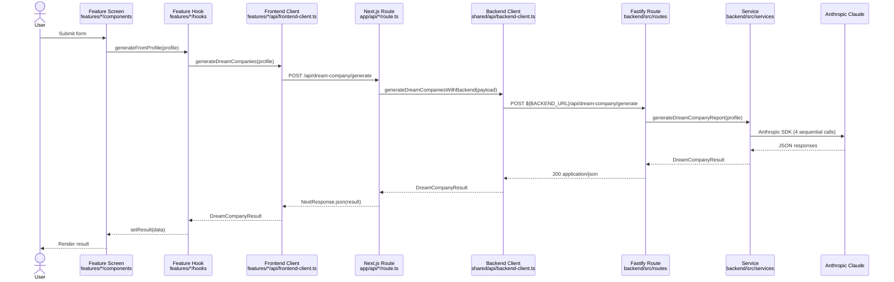

# Architecture

## Product summary

Advance Academy is a career-tools web app with four AI-powered features:

1. **CV Optimizer** — analyzes a CV against a job description and returns section-by-section scores and expert feedback.
2. **Dream Company Finder** — profile in, 4-step career intelligence pipeline out (market level, company matrix, target roles, career roadmap).
3. **Outreach Generator** — generates a LinkedIn message and an email tailored to a target company, person, and intent.
4. **Interview Prep** — interview preparation (scaffolding in place).

All AI features are powered by Anthropic Claude. The app is **stateless** — no database, no user accounts, no persistent storage. Every feature is a request in / response out.

## Repo layout (high level)

```
/                                 ← Next.js frontend lives at the repo root
├── app/                          Next.js App Router
│   ├── layout.tsx                Root layout, fonts, providers
│   ├── page.tsx                  Home page entry
│   ├── home-page-content.tsx     View switch driven by ?view= query param
│   ├── providers.tsx             React Query provider
│   └── api/                      Server-side proxy routes → backend
│       ├── cv-optimizer/
│       ├── dream-company/
│       └── outreach/
├── features/                     Feature modules
│   ├── home/
│   ├── cv-optimizer/
│   ├── dream-company/
│   ├── outreach/
│   └── interview-prep/
├── shared/                       Cross-feature utilities
│   ├── api/                      http-client, backend-client
│   ├── env/                      server.ts, client.ts
│   ├── config/                   navigation config
│   └── utils/                    cn.ts
├── components/                   Global UI (navigation, ornamental-divider)
│   └── ui/                       shadcn/ui primitives (~59)
├── types/                        Cross-feature TS types
├── packages/contracts/           Shared contracts (@advance-academy/contracts)
├── backend/                      Fastify + TypeScript workspace
│   └── src/
│       ├── main.ts               Entry point
│       ├── config/llm.ts         Feature → model mapping
│       ├── routes/               Thin HTTP handlers
│       ├── services/             Business logic + LLM calls
│       ├── lib/                  Prompts, Anthropic SDK helpers
│       └── types/                Backend TS types
└── public/                       Static assets
```

## The 4-layer request flow

Every feature request travels through the same four layers. The Dream Company "generate" flow is the canonical example:



Every feature — CV Optimizer, Dream Company, Outreach — follows this exact shape. **If you're adding something new, replicate it.**

## Why a Next.js proxy layer?

A reasonable question: why not call the Fastify backend directly from the browser?

Three reasons:

1. **`BACKEND_URL` stays server-only.** The proxy route reads it via `shared/env/server.ts`. The browser never sees or needs it, so internal URLs stay internal.
2. **Server-side validation.** Each `app/api/*/route.ts` validates the request body with a type guard before forwarding. Malformed requests are rejected at the edge and never reach Fastify.
3. **Normalized error shape.** The `HttpClientError` thrown by `shared/api/http-client.ts` is caught in every proxy route and converted into a consistent `ApiErrorResponse` (`{ code, message }`) that the frontend already knows how to handle.

As a side benefit, when you deploy Next.js to Vercel and Fastify to a separate service, the browser only needs to know about the Next.js origin — CORS stays simple and `FRONTEND_URL` only needs to match one host.

## Component diagram

```mermaid
flowchart LR
    Browser[Browser]

    subgraph NextJS["Next.js (port 3000)"]
        Pages[app/ pages + features/]
        Proxy[app/api/*/route.ts<br/>proxy routes]
    end

    subgraph Fastify["Fastify backend (port 4000)"]
        Routes[routes/]
        Services[services/]
        Lib[lib/ prompts + helpers]
    end

    Anthropic[Anthropic API]
    Jina[Jina API<br/>r.jina.ai]
    Files[(PDF/DOCX<br/>pdf-parse + mammoth)]

    Browser -->|HTTP| Pages
    Pages -->|fetch /api/*| Proxy
    Proxy -->|fetch BACKEND_URL| Routes
    Routes --> Services
    Services --> Lib
    Services -->|@anthropic-ai/sdk<br/>or HTTP JSON| Anthropic
    Services -.->|outreach URL extract| Jina
    Services -.->|multipart upload| Files
```

## State & persistence

**There is no database.** Make peace with this early.

- **Dream Company, Outreach, Interview Prep** — pure request/response. No state.
- **CV Optimizer** — has a polling pattern. `POST /api/cv-optimizer/analyze` returns `202` + a `jobId`, and the client polls `GET /api/cv-optimizer/jobs/:jobId`. The job map is **in-memory**:

  ```ts
  const jobs = new Map<jobId, JobStatusResponse>()
  ```

  **Gotcha #1:** This is sticky to a single process. If you deploy multiple backend instances behind a load balancer, the poll can land on a different instance and return "not found". Use sticky sessions, an external store (Redis), or stay on a single instance. This is the most important thing to know about the architecture.

- **No user accounts.** No auth. The app is a public tool.

## Cross-cutting concerns

### CORS

Configured in `backend/src/main.ts:33-36`. Reads `FRONTEND_URL` from `backend/.env` and splits on commas for multiple origins:

```ts
await app.register(cors, {
  origin: frontendUrl.split(',').map((url) => url.trim()),
  credentials: true,
})
```

### Error shape

All errors — frontend, proxy, backend — conform to `ApiErrorResponse` from `@advance-academy/contracts`:

```ts
interface ApiErrorResponse {
  code: string    // e.g. 'HTTP_ERROR', 'TIMEOUT', 'INVALID_REQUEST'
  message: string
}
```

- **Frontend** — `shared/api/http-client.ts` throws `HttpClientError` carrying `status` and the parsed payload.
- **Proxy** — catches `HttpClientError` and re-emits with `NextResponse.json(error.payload, { status: error.status || 500 })`.
- **Backend** — services throw `Error` with `statusCode` or `step` properties; routes inspect those and map to the right HTTP code. See `backend/src/routes/dream-company.ts:10-65` as the canonical pattern.

### Timeouts

| Layer | Default | Set in |
|---|---|---|
| Frontend `fetchJson` | 15s | `shared/api/http-client.ts:28` |
| Frontend `fetchFormDataJson` | 120s | `shared/api/http-client.ts:83` |
| Backend client (per-feature) | 10–120s | `shared/api/backend-client.ts` |
| LLM HTTP call | 30s | `LLM_TIMEOUT_MS` env var |

Dream Company is the slowest feature (~60–120s because it runs 4 sequential LLM calls), which is why its backend-client timeout is set to 120s.

### Authentication

**None.** Every endpoint is public. Do not add auth without a product decision. If you do add it, the right place is middleware in `backend/src/main.ts` and a hook in `shared/api/backend-client.ts`.

## Where to go next

- [BACKEND.md](./BACKEND.md) — layered backend deep-dive
- [FRONTEND.md](./FRONTEND.md) — feature module anatomy
- [ADD_A_FEATURE.md](./ADD_A_FEATURE.md) — walkthrough of building a new feature end-to-end
