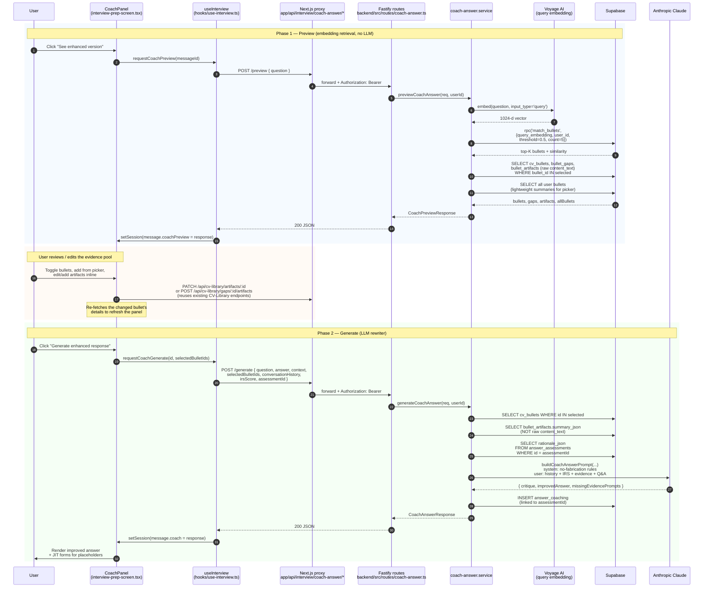

# Interview Prep — "Enhance Response" Flow

End-to-end trace of what happens when a user clicks **See enhanced version** under one of their answered questions in the Interview Prep chat. The feature returns an LLM-rewritten version of the candidate's answer, grounded only in evidence the candidate has previously supplied (CV bullets + artifacts attached to gaps).

The internal name for this feature is **coach-answer**.

> **Note on history.** Before April 2026 this feature was a single LLM call that picked relevant bullets via an LLM-as-ranker prompt, sent the entire CV bullet pool to the rewriter, and gave the user no chance to inspect or edit the evidence before generation. That design is gone. The current flow is a **two-phase preview → generate split** with embedding retrieval, user-editable evidence, conversation history, and IRS-aware rewriting. Search history below for "Why this changed" if you need the rationale.

## The 30-second summary

Clicking the button is a **two-phase interaction**, each one HTTP request:

1. **Preview** (`POST /api/interview/coach-answer/preview`). Server runs an embedding query over the user's whole CV bullet pool, picks the top 1–5 above a 0.50 cosine-similarity threshold, and returns those bullets along with their gaps + **raw artifact text** for the user to inspect. No LLM tokens are spent. The user sees a panel showing exactly what the AI coach is about to be shown, and can:
   - **Toggle bullets off** they don't want sent.
   - **Add other bullets** from their pool via a search picker (lazy-loads gaps + raw artifacts on add).
   - **Expand a bullet** to see its gaps and the raw text the user previously supplied as artifacts.
   - **Edit an artifact in place** (PATCH the existing CV-Library endpoint).
   - **Add an artifact to an unanswered gap** in place (POST the existing CV-Library endpoint).

2. **Generate** (`POST /api/interview/coach-answer/generate`). User clicks the Generate button. Server fetches the **artifact summaries** (not raw text) for the user-edited bullet selection, builds the rewriter prompt with the question + answer + selected evidence + recent conversation history + IRS score + per-dimension rationale, and runs the rewriter LLM. Returns `{ critique, improvedAnswer, missingEvidencePrompts[] }` — same shape as before. Placeholders in `improvedAnswer` of the form `[CANDIDATE TO FILL: bulletId|question]` surface as inline JIT clarification forms; saving any of them re-fires Generate (not Preview) so the user's curated selection is preserved.

## Why this changed

Three concrete problems with the previous flow:

1. **LLM-as-ranker was slow and expensive for what it did.** A 2–6s LLM call to pick 1–3 of N bullets, then another LLM call to do the rewrite. With 1024-dim embeddings already stored on every bullet at insert time, vector search was the obvious replacement.
2. **The rewriter saw the entire CV pool.** Every coach-answer call sent every bullet from every CV version to the rewriter "for context." This bloated prompts, polluted them with irrelevant material, and contradicted the doc's own claim that retrieval was bullet-level.
3. **The user had zero control over the evidence pool.** Whatever the LLM ranker picked got fed to the rewriter, full stop. If it picked the wrong bullets, you waited 10–25s, got a bad rewrite, and had to start over. Now the evidence pool is shown to the user *first*, with the underlying raw artifact text, and the rewriter doesn't run until they click Generate.

The change is also why prompts now include conversation history and IRS rationale: once the user can see what's going to the LLM, "what else should the LLM see" becomes a natural design question.

## High-level diagram



## What context is fed into the LLM (the part that matters)

This is the critical part of the feature. Only the **Generate** call touches the LLM; Preview is pure retrieval.

### The Generate prompt

[backend/src/lib/cv-knowledge/prompts.ts — `buildCoachAnswerPrompt`](../backend/src/lib/cv-knowledge/prompts.ts)

| Input | Source | Notes |
|---|---|---|
| `jobTitle`, `companyName`, `jobDescription` | The session context | Sent verbatim |
| **Conversation history** | Last 10 turns from the active session (`COACH_HISTORY_TURNS` in `coach-answer.service.ts`) | NEW — see below |
| **IRS score + rationale** | `irsScore` from the request body, `rationale_json` from `answer_assessments` row keyed by `assessmentId` | NEW — see below |
| Selected bullets | The user-edited `selectedBulletIds[]` — top-1-5 from embedding retrieval, then optionally edited by the user | Each bullet contributes its `bullet_text` and `section_path` |
| Artifact **summaries** for those bullets | `bullet_gaps` → `bullet_artifacts.summary_json` join | See "Artifact retrieval" below |
| Interview question | The single question being enhanced | |
| Candidate's original answer | The text the candidate typed/spoke | |

The system prompt enforces hard rules:

1. **Only** use facts from the candidate's answer + selected bullets + artifact summaries.
2. **Never** invent metrics, dates, team sizes, tech stacks, client names, percentages, or outcomes.
3. Where a fact is missing, emit `[CANDIDATE TO FILL: <bulletId>|<short question>]`.
4. Use STAR structure where it fits.
5. Match the candidate's voice. First person.
6. **Use the IRS feedback to prioritise improvements** — if Substance scored low, lean harder on metrics; if Relevance scored low, tie back to the JD; if Integrity scored low, stay closer to what the candidate actually said.
7. **Use the conversation history for coherence** — don't reuse phrasing the candidate already used in earlier turns and don't contradict facts they already stated.

Output is JSON: `{ critique, improvedAnswer, missingEvidencePrompts[] }` — unchanged from the previous version of this feature.

### Conversation history

The frontend (`hooks/use-interview.ts` `requestCoachGenerate`) takes every message in `session.messages` *before* the message being enhanced and passes them through as `{ role, content }[]`. The server caps that to the last 10 turns (`COACH_HISTORY_TURNS`) — roughly the last 5 question/answer pairs, more than enough for coherence without bloating the prompt.

### IRS score and rationale

`irsScore` (the four numbers — Integrity, Relevance, Substance, Overall) is sent in the request body straight from `message.irsScore` on the frontend. `rationale_json` (the per-dimension explanation strings) lives in the `answer_assessments` table and is loaded server-side by `loadIrsRationale(assessmentId)` — keeping the wire payload smaller and the source of truth in the DB.

If `assessmentId` is missing from the request (e.g. an answer that hasn't been scored yet), the rationale block becomes "(no IRS scoring available for this answer)" and the model proceeds without it. If the score is present but the assessment row has no rationale, the score numbers still appear and the rationale text is just elided.

### Artifact retrieval — the high-level mental model

Artifacts are pieces of evidence the user uploaded earlier (a paragraph of text, JIT-clarification answers, etc.). When uploaded, each artifact was summarised by an LLM into a structured `summary_json` with four fields:

```ts
{
  overview: string,
  my_contribution: string,
  concrete_facts: string[],
  metrics: string[],
}
```

The retrieval works like this:

```
selected bullet (1 of 1–5, user-curated)
   └─→ has many → bullet_gaps
                     └─→ has many → bullet_artifacts
                                       └─→ summary_json  ← what the LLM sees
                                       └─→ content_text  ← what the USER sees in the preview panel,
                                                            but NEVER sent to the LLM
```

So **for each selected bullet, ALL of that bullet's artifact summaries are included** — no per-artifact ranking, no top-K filter on artifacts themselves. This is intentional: each artifact answers a specific gap question for that bullet, so by construction every artifact is at least loosely on-topic for its parent bullet. The "selection" happens at the bullet level. Sending raw `content_text` to the LLM is intentionally avoided — it's an arbitrary blob of user-supplied prose; summaries are the structured form designed for prompt use. Raw text is shown to the user in the preview panel so they can verify what they previously said, but it never crosses the LLM boundary.

If a selected bullet has no answered gaps, the prompt explicitly tells the model so (`(no attached artifacts for this bullet)`) and the model leans on the bullet text alone, surfacing more `[CANDIDATE TO FILL: …]` placeholders.

### What is NOT sent (worth knowing)

- **No raw artifact `content_text`.** Only `summary_json`. If the original summarisation went wrong, it's wrong here too — but the user can fix it via the Edit button in the preview panel before clicking Generate.
- **No CV-version filtering.** The user's *active* CV is irrelevant to coach-answer — the retrieval queries the whole bullet pool across every CV version. Intentional: more evidence = better grounding.
- **No per-artifact relevance ranking.** Artifacts are assumed to be relevant to their parent bullet because each one answers a specific gap question for that bullet.
- **No bullets the user explicitly removed.** The Preview pre-selection is a starting point, not a contract — if the user toggles a bullet off, it never reaches the rewriter.

## Step-by-step breakdown (with file references)

### Frontend — `CoachPanel`

[features/interview-prep/components/interview-prep-screen.tsx](../features/interview-prep/components/interview-prep-screen.tsx) (search for `function CoachPanel`)

The button has three states based on the message:
- No `coachPreview` yet → label "See enhanced version" → first click runs Preview.
- `coachPreview` present, no `coach` yet → user is reviewing/editing the evidence pool. Label toggles between "Review evidence" / "Hide evidence panel".
- `coach` present → label toggles between "Show enhanced version" / "Hide enhanced version".

Sub-components:

- `CoachBulletRow` — one row per selected bullet, with similarity %, artifact count, expand toggle, and a remove button.
- `CoachGapBlock` — inside an expanded bullet, one block per gap. Either lists artifacts with `CoachArtifactView` or shows an "unanswered" badge with an "Add answer" button that opens `CoachArtifactComposer`.
- `CoachArtifactView` — read-only by default (raw `contentText` only); Edit button → inline textarea → PATCH `/api/cv-library/artifacts/:id` (existing endpoint, re-summarises server-side).
- `CoachArtifactComposer` — textarea → POST `/api/cv-library/gaps/:id/artifacts` (existing endpoint).
- `CoachBulletPicker` — searchable list of every user bullet (filtered by text + section), excluding bullets already selected. Click → lazy-loads bullet details via `GET /api/cv-library/bullets/:id/details` (new endpoint) and adds to the selection.

When any in-place edit changes an artifact, `handleRefreshBullet` re-fetches that bullet's details and updates `coachPreview.bullets` in place — no full preview re-fetch.

### Hook — `useInterview` (preview / generate / setCoachPreview)

[hooks/use-interview.ts](../hooks/use-interview.ts) (search for `requestCoachPreview`, `requestCoachGenerate`, `setCoachPreview`)

- `requestCoachPreview(messageId)` — POSTs `{ question }` to `/api/interview/coach-answer/preview`. On success, stashes the response on `message.coachPreview`.
- `setCoachPreview(messageId, coachPreview)` — synchronous helper for the panel to update the in-memory preview after a picker-add or in-place artifact edit, without re-running embedding retrieval.
- `requestCoachGenerate(messageId, selectedBulletIds)` — builds `conversationHistory` from `session.messages` *before* the target message, POSTs to `/api/interview/coach-answer/generate`. On success, stashes the rewriter response on `message.coach`.
- `submitJitClarification(messageId, promptIndex, answer, selectedBulletIds)` — POSTs to `/api/cv-library/jit-clarification` (existing) and then re-runs `requestCoachGenerate` with the same selection. Importantly: it does NOT re-run Preview, so the user's curated bullet selection is preserved across the JIT round-trip.

### Next.js proxies

- [app/api/interview/coach-answer/preview/route.ts](../app/api/interview/coach-answer/preview/route.ts)
- [app/api/interview/coach-answer/generate/route.ts](../app/api/interview/coach-answer/generate/route.ts)
- [app/api/cv-library/bullets/[id]/details/route.ts](../app/api/cv-library/bullets/%5Bid%5D/details/route.ts) — picker-add lazy load.

All three follow the standard pattern: `getProxyAuthToken` → `*WithBackend` from `shared/api/backend-client.ts` → normalize `HttpClientError`.

### Auth + rate limiting

Same global Fastify auth preHandler as every other route. Per-route rate limits (in [backend/src/routes/coach-answer.ts](../backend/src/routes/coach-answer.ts)):

- Preview: **10 / minute, keyed by user**. Permissive because there's no LLM cost.
- Generate: **1 / minute, keyed by user**. Strict because each call is an LLM round-trip.

The single shared 1/min cap from the old design is gone. The Preview cap is loose enough that users can iterate (toggle bullets, edit artifacts, re-fetch a stale bullet) without bumping into it; the Generate cap protects the LLM budget.

### Service — `previewCoachAnswer`

[backend/src/services/coach-answer.service.ts](../backend/src/services/coach-answer.service.ts) — `previewCoachAnswer`

1. **Embed** the question via Voyage 3.5-lite (`embedText(question, 'query')`).
2. **Call** `match_bullets` Supabase RPC with `threshold = COACH_SIMILARITY_THRESHOLD` (0.50) and `match_count = COACH_TOPK` (5). Returns rows with similarity = `1 − cosine_distance`.
3. **In parallel** fetch:
   - `getBulletsWithGapsByIds(userId, selectedIds)` — full gaps + RAW artifact `content_text` for the auto-selected bullets.
   - `listUserBulletSummaries(userId)` — lightweight `{id, bulletText, sectionPath, gapCount, answeredGapCount}` for every user bullet (for the picker).
4. **Shape** the response:
   ```ts
   {
     selectedBulletIds: string[],   // similarity-ordered
     bullets: CoachPreviewBullet[], // selected bullets with gaps + raw artifacts
     allBullets: UserBulletSummaryDto[], // every user bullet, lightweight
     threshold: number,             // echoed back so the UI can show "≥ 50%"
   }
   ```

Typical latency: **<800ms** total (one Voyage embed call ~200–400ms, two parallel Supabase queries ~200–400ms).

### Service — `generateCoachAnswer`

[backend/src/services/coach-answer.service.ts](../backend/src/services/coach-answer.service.ts) — `generateCoachAnswer`

1. **Validate** that `selectedBulletIds` is a deduped non-null list (empty is allowed — the LLM will rely purely on the candidate's answer).
2. **Fetch** for the selected bullets, in parallel:
   - `getBulletsWithGapsByIds(userId, selectedIds)` — bullet text + section.
   - `loadEvidenceSummaries(selectedIds)` — `bullet_gaps` → `bullet_artifacts.summary_json`. Raw `content_text` is *not* fetched here.
3. **Fetch** `rationale_json` from `answer_assessments` if `assessmentId` is present.
4. **Trim** `conversationHistory` to the last `COACH_HISTORY_TURNS` (10).
5. **Build** the prompt via `buildCoachAnswerPrompt`.
6. **Call** Anthropic with `max_tokens: 2048`. The model is the Interview Prep model from `config/llm.ts`.
7. **Parse** + sanitise the JSON. If the LLM returns no `missingEvidencePrompts`, regex over the `improvedAnswer` for `[CANDIDATE TO FILL: …]` placeholders.
8. **Decorate** prompts with bullet text from the in-memory evidence (so the JIT forms can show "re: \<bullet text\>").
9. **Persist** to `answer_coaching` if `assessmentId` is present (best-effort; storage failure doesn't fail the request).

Typical latency: **8–20s**, dominated by the rewriter LLM call.

### Single-bullet details endpoint

[backend/src/routes/cv-library.ts](../backend/src/routes/cv-library.ts) — `GET /api/cv-library/bullets/:id/details`

Wraps `getBulletsWithGapsByIds(userId, [id])`. Used by the picker for lazy loading and by `handleRefreshBullet` to update a single bullet after an in-place edit.

## Latency budget

| Phase | Stage | Typical | Notes |
|---|---|---|---|
| Preview | Auth + proxy | <300ms | |
| Preview | **Voyage query embedding** | **200–400ms** | Single text |
| Preview | match_bullets RPC | <200ms | HNSW index on `cv_bullets.bullet_embedding` |
| Preview | Bullets + gaps + raw artifacts query | <300ms | One round-trip with `IN (...)` |
| Preview | All-bullets summary query | <200ms | Lightweight fields only |
| **Preview total** | | **~0.7–1.5s** | What the spinner is hiding |
| Generate | Auth + proxy | <300ms | |
| Generate | Bullets + summaries + rationale fetches | <500ms | Three parallel Supabase queries |
| Generate | **Rewriter LLM** | **8–20s** | 2048 max output; prompt is bounded |
| **Generate total** | | **~9–22s** | What the spinner is hiding |

Backend client timeout is 30s for Preview, 90s for Generate.

## Failure modes

- **Voyage API key missing or down** → `embedText` returns null → Preview returns `{ selectedBulletIds: [], bullets: [], allBullets: [...] }`. The user sees "No bullets selected" and can manually add from the picker, then click Generate.
- **`match_bullets` RPC missing** (e.g. migration 007 hasn't been applied to this Supabase instance) → `findSimilarBulletsByEmbedding` logs an error and falls back to `findSimilarBulletsDirect`, which returns an arbitrary slice of the user's bullets with `similarity: 0`. The Preview UI still works but the auto-selection is meaningless. **Run migration 007 to fix.** This same fallback affects the CV-Library "Merge bullet" feature, which calls the same code path with `threshold = MERGE_SIMILARITY_THRESHOLD` (0.40).
- **No bullets pass the threshold** → Preview returns empty `bullets[]` + non-empty `allBullets[]`. The UI shows "No clearly relevant bullets found — add some manually below." User can pick from the full pool.
- **User clicks Generate with zero bullets selected** → 200 OK with a `(no attached evidence)` block in the prompt. The LLM rewrites from the answer alone; expect many placeholders.
- **`rationale_json` lookup fails** → silently elided from the prompt. The score numbers still appear if `irsScore` was passed.
- **Rewriter LLM returns invalid JSON** → 502 with `"Failed to parse coach LLM response"`.
- **Rewriter LLM returns no `missingEvidencePrompts`** → server regexes the `improvedAnswer` for placeholders and synthesises the prompts.
- **Rate limited** → 429 with `{ code: 'RATE_LIMIT_EXCEEDED', scope, message }`. The frontend's existing `readErrorMessage` reads `body.message` and surfaces it in the red error banner.
- **JIT clarification mid-flight** → re-runs Generate (not Preview), so the user's curated selection is preserved.

## Possible improvements

These aren't bugs — just design space we haven't explored:

1. **Hybrid retrieval (embedding pre-filter → LLM re-rank).** The embedding ranker can miss strongly-paraphrased questions (e.g. "tell me about a tough decision" vs a bullet about a specific design call). A cheap LLM pass over the top-20 by embedding could pick a better top-5. Adds 1–3s to Preview, costs LLM tokens — would need a clear quality win to justify.
2. **Per-artifact ranking.** Today every artifact of a chosen bullet goes into the prompt. With many filled gaps per bullet, the prompt grows linearly. A second pass could pick the top-K artifacts across selected bullets. The simplest version: filter artifacts whose summary embeds close to the question.
3. **Cache Preview responses.** A user who asks the same question twice in the same session (rare but possible — e.g. retrying after editing artifacts) gets a fresh Voyage embed each time. A 60s in-memory cache keyed by `(userId, question)` would cut latency to ~0 on retry.
4. **Show similarity bands in the UI.** "Strong match (≥70%)" / "Likely match (50–70%)" colour bands would let the user judge which auto-selected bullets to keep at a glance.
5. **Allow "Generate from question only" without any bullets.** Already works (server allows empty `selectedBulletIds`), but the UI doesn't make it discoverable. A "Skip — generate from my answer alone" button would expose it.

## Index of touchpoints

- Migration: [supabase/migrations/007_match_bullets_rpc.sql](../supabase/migrations/007_match_bullets_rpc.sql)
- Service: [backend/src/services/coach-answer.service.ts](../backend/src/services/coach-answer.service.ts)
- Service helpers (retrieval, per-bullet, picker pool): [backend/src/services/cv-knowledge.service.ts](../backend/src/services/cv-knowledge.service.ts) — `findRelevantBulletsForCoach`, `getBulletsWithGapsByIds`, `listUserBulletSummaries`, `findSimilarBullets` (merge feature)
- Prompt: [backend/src/lib/cv-knowledge/prompts.ts](../backend/src/lib/cv-knowledge/prompts.ts) — `buildCoachAnswerPrompt`
- Routes: [backend/src/routes/coach-answer.ts](../backend/src/routes/coach-answer.ts), [backend/src/routes/cv-library.ts](../backend/src/routes/cv-library.ts) (`/bullets/:id/details`)
- Backend client: [shared/api/backend-client.ts](../shared/api/backend-client.ts) — `coachAnswerPreviewWithBackend`, `coachAnswerGenerateWithBackend`, `getBulletDetailsWithBackend`
- Proxies: [app/api/interview/coach-answer/preview/route.ts](../app/api/interview/coach-answer/preview/route.ts), [app/api/interview/coach-answer/generate/route.ts](../app/api/interview/coach-answer/generate/route.ts), [app/api/cv-library/bullets/[id]/details/route.ts](../app/api/cv-library/bullets/%5Bid%5D/details/route.ts)
- Hook: [hooks/use-interview.ts](../hooks/use-interview.ts) — `requestCoachPreview`, `requestCoachGenerate`, `setCoachPreview`, `submitJitClarification`
- UI: [features/interview-prep/components/interview-prep-screen.tsx](../features/interview-prep/components/interview-prep-screen.tsx) — `CoachPanel`, `CoachBulletRow`, `CoachGapBlock`, `CoachArtifactView`, `CoachArtifactComposer`, `CoachBulletPicker`
- Types: [features/interview-prep/types.ts](../features/interview-prep/types.ts) — `CoachPreview`, `CoachPreviewBullet`, `UserBulletSummaryDto`; [backend/src/types/cv-knowledge.ts](../backend/src/types/cv-knowledge.ts) — server-side equivalents
