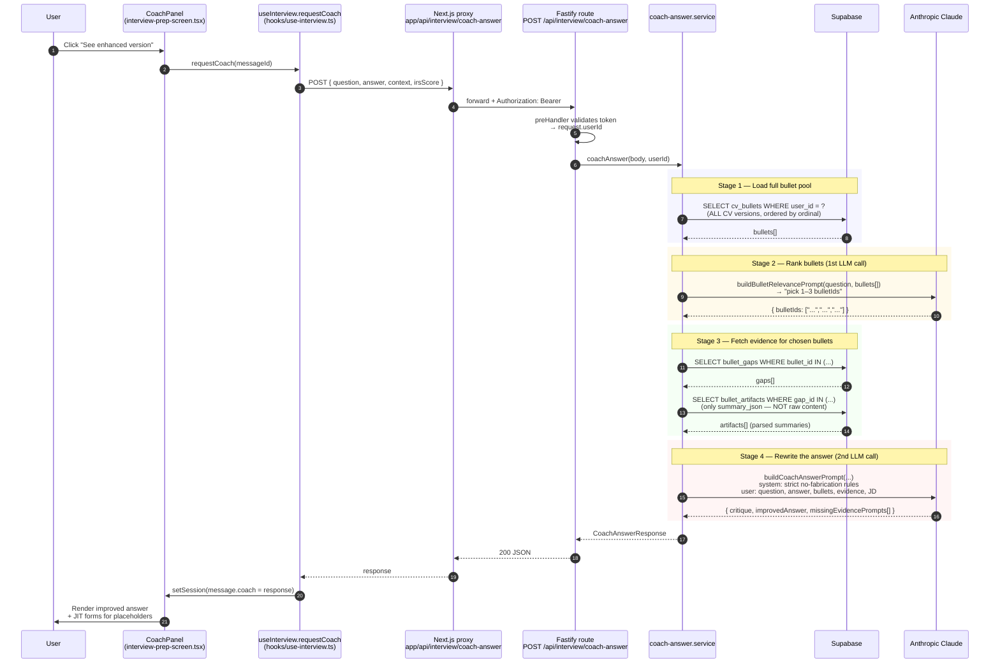

# Interview Prep — "Enhance Response" Flow

End-to-end trace of what happens when a user clicks **See enhanced version** under one of their answered questions in the Interview Prep chat. The feature returns an LLM-rewritten version of the candidate's answer, grounded only in evidence the candidate has previously supplied (CV bullets + artifacts attached to gaps).

The internal name for this feature is **coach-answer**.

## The 30-second summary

Clicking the button fires **one synchronous HTTP request** that runs a 4-stage pipeline on the backend:

1. Pull the user's **entire CV bullet pool** from Supabase.
2. **Rank bullets by relevance** to the interview question via a *first* LLM call → pick top 1–3.
3. Fetch all artifacts attached to those bullets (via the `bullet_gaps` join).
4. Call Claude *again* with the question, the candidate's answer, the chosen bullets, the artifact summaries, and strict no-fabrication rules → get back `{ critique, improvedAnswer, missingEvidencePrompts[] }`.

The improved answer can contain `[CANDIDATE TO FILL: bulletId|question]` placeholders wherever the LLM thinks a fact is missing. Those placeholders surface as inline JIT (just-in-time) clarification forms in the UI. Saving an answer to one of them re-fires this whole pipeline.

## High-level diagram



## What context is fed into the LLM (the part that matters)

This is the critical part of the feature. The "enhanced response" call is a **2-LLM-call pipeline**, and each call sees a different subset of the user's data.

### Call 1 — Bullet ranker

[backend/src/lib/cv-knowledge/prompts.ts:84-99](../backend/src/lib/cv-knowledge/prompts.ts#L84-L99)

| Input | Source |
|---|---|
| Interview question | The single question being answered (from `msg.questionAsked`) |
| Whole CV bullet pool | `SELECT id, section_path, bullet_text FROM cv_bullets WHERE user_id = ?` — all versions, all sections |

The model is asked to return up to 3 `bulletIds`. If the user has ≤ 4 bullets total, this LLM call is **skipped** and all bullets are returned. If the LLM call fails or returns no IDs, the fallback is *the first 3 bullets by ordinal*.

**Retrieval shape:** this is **LLM-as-ranker**, not vector similarity. There is no embedding lookup here. The whole pool is sent in the prompt — fine for dozens of bullets, would not scale to thousands.

### Call 2 — Answer rewriter (the actual "enhance")

[backend/src/lib/cv-knowledge/prompts.ts:113-185](../backend/src/lib/cv-knowledge/prompts.ts#L113-L185)

| Input | Source | Notes |
|---|---|---|
| `jobTitle`, `companyName`, `jobDescription` | The session context from `useInterview` | Sent verbatim |
| **All** of the user's CV bullets | Same query as Call 1, formatted as `(section) bullet text` | Yes — sent in *both* LLM calls |
| **Top 1–3 ranked bullets** | Output of Call 1 | These get the full "evidence block" treatment below |
| **Artifact summaries** for those bullets | `bullet_gaps` → `bullet_artifacts.summary_json` join | See "Artifact retrieval" below |
| Interview question | Same as Call 1 | |
| Candidate's original answer | The text the candidate typed/spoke | |

The system prompt enforces three hard rules:
1. **Only** use facts from the candidate's answer + bullets + evidence blocks.
2. **Never** invent metrics, dates, team sizes, tech stacks, client names, percentages, or outcomes.
3. Where a fact is missing, emit a placeholder of the form `[CANDIDATE TO FILL: <bulletId>|<short question>]`.

Output is JSON: `{ critique, improvedAnswer, missingEvidencePrompts[] }`.

### Artifact retrieval — the high-level mental model

Artifacts are pieces of evidence the user uploaded earlier (a paragraph of text, a URL like a project README, or an attached file). When uploaded, each artifact was summarised by an LLM into a structured `summary_json` with four fields:

```ts
{
  overview: string,
  my_contribution: string,
  concrete_facts: string[],
  metrics: string[],
}
```

The retrieval works like this:

```
chosen bullet (1 of 1–3)
   └─→ has many → bullet_gaps (the questions we identified for this bullet)
                     └─→ has many → bullet_artifacts (each gap's evidence)
                                       └─→ summary_json  ← THIS is what's sent to the LLM
```

So **for each of the 1–3 ranked bullets, ALL of that bullet's artifact summaries are included** — no per-artifact ranking, no top-K filter on artifacts themselves. The "selection" happens purely at the bullet level. Raw content (full text of an uploaded README, full extracted PDF text, etc.) is **not** sent — only the parsed `summary_json`. This keeps the prompt token count predictable.

If the chosen bullets have no answered gaps yet, the evidence block is the literal string `"(no attached evidence — rely on CV bullets and candidate answer only)"` — the LLM will lean on the bullet text alone and likely emit more `[CANDIDATE TO FILL: …]` placeholders.

### What is NOT sent (worth knowing)

These are facts about the *current* implementation, not bugs — but they're easy to assume otherwise.

- **No conversation history.** Only the single question being enhanced and the candidate's single answer go into the prompt. Earlier Q&A turns from the same session are not visible to the coach. The `requestCoach` payload at [hooks/use-interview.ts:204-222](../hooks/use-interview.ts#L204-L222) doesn't include `session.messages`.
- **`irsScore` is sent but unused** in the prompt. The Integrity / Relevance / Substance score the answer received is in the request body but never reaches `buildCoachAnswerPrompt`. It could be used to tell the LLM *which dimension* to improve most aggressively, but currently it's effectively dead metadata for this endpoint.
- **No raw artifact content.** Only the structured `summary_json` derived at upload time. If summarisation went wrong, it's wrong here too.
- **No CV-version filtering.** The candidate's *active* CV is irrelevant to coach-answer — the whole pool from every CV version is searched. This is intentional (more evidence = better grounding).
- **No per-artifact relevance ranking.** All artifacts of a chosen bullet are sent regardless of whether they relate to the question.

## Step-by-step breakdown (with file references)

### Frontend — `CoachPanel.handleClick`

[features/interview-prep/components/interview-prep-screen.tsx:823-894](../features/interview-prep/components/interview-prep-screen.tsx#L823-L894)

- Renders the **See enhanced version** button on each candidate-answered message.
- On first click, calls `onRequestCoach(message.id)` and toggles open. Subsequent clicks just toggle visibility (the response is cached on the message).
- After the response lands, renders `message.coach.improvedAnswer` with `[CANDIDATE TO FILL: ...]` placeholders highlighted, plus a `JitForm` for each missing-evidence prompt.

### Hook — `useInterview.requestCoach`

[hooks/use-interview.ts:198-238](../hooks/use-interview.ts#L198-L238)

- Looks up the message by ID. Bails if it isn't a `candidate` message with a `questionAsked`.
- POSTs to `/api/interview/coach-answer` with `{ question, answer, context, irsScore }`.
- On success, mutates the message in `session.messages` to attach `coach: CoachResult`.

### Next.js proxy — `app/api/interview/coach-answer/route.ts`

[app/api/interview/coach-answer/route.ts:6-20](../app/api/interview/coach-answer/route.ts#L6-L20)

- Pulls the bearer token via `getProxyAuthToken(request)`.
- Forwards the JSON body via `coachAnswerWithBackend(body, authToken)`.
- Maps `HttpClientError` to the same status the backend returned; everything else → 400.

### Backend client — `coachAnswerWithBackend`

[shared/api/backend-client.ts:425-438](../shared/api/backend-client.ts#L425-L438)

- Adds the `Authorization: Bearer <token>` header.
- Uses `timeoutMs: 90000` (90s) — generous because two sequential LLM calls.

### Auth gate — Fastify `preHandler`

[backend/src/main.ts:61-74](../backend/src/main.ts#L61-L74)

- Validates the token, attaches `request.userId`.

### Fastify route — `POST /api/interview/coach-answer`

[backend/src/routes/coach-answer.ts:5-24](../backend/src/routes/coach-answer.ts#L5-L24)

- Validates `question`, `answer`, `context` are present.
- Calls `coachAnswer(body, request.userId)`.
- Maps any `Error.statusCode` to the HTTP status.

### Service stage 1 — Load full bullet pool

[backend/src/services/coach-answer.service.ts:46-56](../backend/src/services/coach-answer.service.ts#L46-L56)

- One Supabase query: `SELECT id, section_path, bullet_text FROM cv_bullets WHERE user_id = ?`.
- This becomes the `cvBullets` block in the rewriter prompt.
- Typical latency: **<200ms**.

### Service stage 2 — Rank relevant bullets (1st LLM call)

[backend/src/services/cv-knowledge.service.ts:748-778](../backend/src/services/cv-knowledge.service.ts#L748-L778)

- If `bullets.length <= 4` → return all bullets, skip the LLM.
- Else: `llmJson(buildBulletRelevancePrompt(question, bullets))` — Claude returns up to 3 bullet IDs.
- Filter the original bullets list to those IDs (preserves order).
- On any failure: fall back to `bullets.slice(0, 3)`.
- Typical latency: **2–6s**.

### Service stage 3 — Fetch evidence (artifacts) for chosen bullets

[backend/src/services/cv-knowledge.service.ts:781-806](../backend/src/services/cv-knowledge.service.ts#L781-L806) called from [coach-answer.service.ts:62-75](../backend/src/services/coach-answer.service.ts#L62-L75)

- Two Supabase queries:
  1. `SELECT id, bullet_id FROM bullet_gaps WHERE bullet_id IN (...)`
  2. `SELECT gap_id, summary_json FROM bullet_artifacts WHERE gap_id IN (...)`
- Build a `Map<bulletId, ArtifactSummary[]>` and assemble the `evidence` array passed to the prompt.
- Typical latency: **<500ms**.

### Service stage 4 — Rewrite the answer (2nd LLM call)

[backend/src/services/coach-answer.service.ts:78-126](../backend/src/services/coach-answer.service.ts#L78-L126)

- Build the system + user prompts via `buildCoachAnswerPrompt`.
- `anthropic.messages.create({ model, max_tokens: 2048, system, messages: [{ role:'user', content: user }] })`.
- Strip optional code-fences with `cleanJson`, then `JSON.parse`.
- If the LLM returned no `missingEvidencePrompts` array, fall back to scanning the `improvedAnswer` text for `[CANDIDATE TO FILL: …]` placeholders ourselves.
- Decorate each prompt with the bullet's text (for nicer UI labels).
- Typical latency: **8–20s**.

### Response shape

```ts
{
  critique: string,                       // 1-2 sentences on what was weak
  improvedAnswer: string,                 // STAR-structured rewrite with placeholders
  missingEvidencePrompts: Array<{
    bulletId: string | null,              // tied to a bullet, or 'none'
    bulletText: string | null,            // server-decorated for the UI
    question: string,                     // the gap question to ask the user
  }>,
}
```

The frontend stashes this in `message.coach`. The JIT forms (one per missing-evidence prompt) post answers to `POST /api/cv-library/jit-clarification`, which creates a new `bullet_artifact` of `source_type: 'jit_clarification'`. Saving any clarification then re-fires `requestCoach`, so the placeholder disappears and the rewrite gets richer.

## Latency budget

| Stage | Typical | Notes |
|---|---|---|
| Auth + proxy + multipart parse | <300ms | |
| Load bullet pool | <200ms | One Supabase round-trip |
| **Rank bullets (1st LLM call)** | **2–6s** | Skipped if ≤4 bullets |
| Fetch artifacts | <500ms | Two Supabase round-trips |
| **Rewrite answer (2nd LLM call)** | **8–20s** | Larger prompt + 2048 max output |
| **Total** | **~10–25s** | What the spinner is hiding |

Backend client timeout is 90s — comfortable headroom.

## Failure modes

- **Empty `question` or `answer`** → 400 from the route validator.
- **No CV bullets in the user's pool** → Stage 2 returns `[]`, stage 3 returns empty evidence, the rewrite still runs on the candidate's answer + JD only. Likely yields a generic critique with many placeholders.
- **Bullet-ranker LLM call fails** → fallback to first 3 bullets by ordinal (no error surfaced).
- **Artifact summary missing (`summary_json IS NULL`)** → that artifact is silently dropped.
- **Rewriter LLM returns invalid JSON** → 502 with `"Failed to parse coach LLM response"`.
- **Rewriter LLM returns no `missingEvidencePrompts`** → we regex the `improvedAnswer` for `[CANDIDATE TO FILL: …]` placeholders and synthesise the prompts.
- **Token expired mid-flight** → backend `preHandler` returns 401; the user sees "Failed to coach".

## Possible improvements

These aren't bugs — just things the user's question hinted at that *aren't* in the current implementation, in case we want to revisit:

1. **Include conversation history.** Today the coach sees only one question + one answer. Sending the recent (≤ 5) prior turns would let it avoid repeating phrasing the candidate already used and stay coherent across a multi-turn session. Trade-off: more tokens per call.
2. **Use `irsScore` in the prompt.** The candidate's IRS breakdown is already sent. Telling the rewriter "Substance was 4/10 — focus on adding metrics and concrete results" would make the rewrite more targeted. Cheap to add.
3. **Per-artifact ranking, not per-bullet.** Today we send *all* artifacts of the chosen bullets. With many filled gaps per bullet, the prompt grows linearly. A second ranker pass (or an embedding pre-filter) could pick the top-K most relevant artifacts across the chosen bullets — closer to a real "find 3 most relevant filled artifacts" retrieval.
4. **Replace the bullet-ranker LLM call with embedding similarity.** The infra already exists for `findSimilarBullets` (pgvector + `match_bullets` RPC). Reusing it here would shave 2–6s off latency *and* scale past the "send the whole pool" approach. Trade-off: embedding-similarity is dumber than an LLM ranker for paraphrased questions, so a hybrid (embedding top-20 → LLM picks 3) is probably the right answer.
