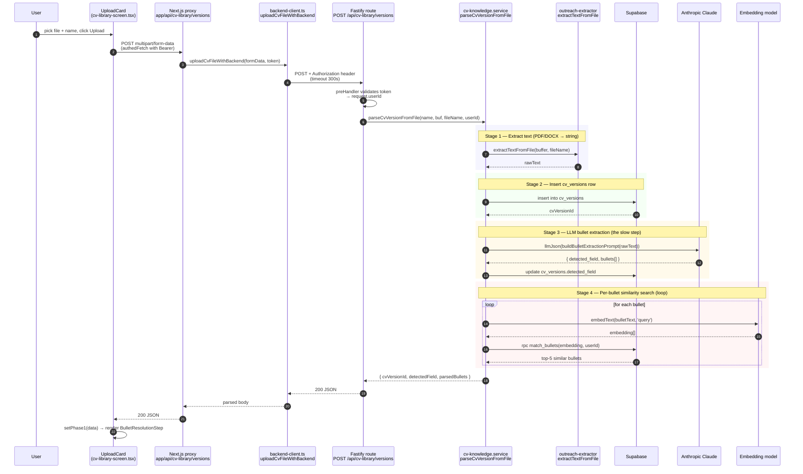

# CV Library — Upload Flow

End-to-end trace of what happens when a user uploads a CV from the **CV Library** page. This is the "Phase 1" parse step: from the user clicking **Upload** until they see the bullet-resolution screen. Phase 2 (finalize / merge bullets) and gap filling are out of scope for this doc.

## The 30-second summary

The upload is **one synchronous HTTP request** that runs a 4-stage pipeline on the backend:

1. Decode the file → text
2. Insert a `cv_versions` row
3. **One LLM call** to extract bullets + detect field
4. **One similarity search per bullet** (embedding + pgvector RPC)

The LLM call dominates total latency (typically 20–60s). The response returns the parsed bullets with similar-bullet candidates so the user can decide *new vs. merge* in Phase 2.

## Diagram



## Step-by-step breakdown

### Frontend — `UploadCard.submit()`

[features/cv-library/components/cv-library-screen.tsx:230-252](../features/cv-library/components/cv-library-screen.tsx#L230-L252)

- Builds a `FormData` with `name` and `file`.
- POSTs to `/api/cv-library/versions` via `authedFetch` (which attaches the Supabase access token as `Bearer`).
- On 2xx, hands the response to `onParsed` → React swaps to `BulletResolutionStep`.
- On error, surfaces the message inline.

### Next.js proxy — `app/api/cv-library/versions/route.ts`

[app/api/cv-library/versions/route.ts:18-32](../app/api/cv-library/versions/route.ts#L18-L32)

- Pulls the bearer token via `getProxyAuthToken(request)`.
- Re-reads the multipart body and forwards via `uploadCvFileWithBackend(formData, authToken)`.
- Maps `HttpClientError` to its original status; everything else → 400.

### Backend client — `shared/api/backend-client.ts`

[shared/api/backend-client.ts:213-220](../shared/api/backend-client.ts#L213-L220)

- Uses `fetchFormDataJson` with **`timeoutMs: 300000` (5 minutes)** — the upload pipeline is the longest synchronous request in the app.
- Adds `Authorization: Bearer <token>` via `authHeaders`.

### Auth gate — Fastify `preHandler`

[backend/src/main.ts:61-74](../backend/src/main.ts#L61-L74)

- Rejects requests without a Bearer token.
- Calls `getUserIdFromToken()` → `supabase.auth.getUser()`.
- Attaches `request.userId` for use in the route.

### Fastify route — `POST /api/cv-library/versions`

[backend/src/routes/cv-library.ts:187-219](../backend/src/routes/cv-library.ts#L187-L219)

- Behind `@fastify/multipart` (15 MB file limit).
- Iterates `request.parts()` to read the `file` and `name` fields.
- Calls `parseCvVersionFromFile(name, buffer, fileName, request.userId)`.

### Service stage 1 — Extract text from file

[backend/src/services/outreach-extractor.service.ts:30-53](../backend/src/services/outreach-extractor.service.ts#L30-L53)

- PDF → `pdf-parse`
- DOCX → `mammoth.extractRawText`
- Anything else → 400. Empty extraction → 422.
- Typical latency: **<1s for small CVs, up to 3–5s for large/scanned PDFs**.

### Service stage 2 — Insert `cv_versions` row

[backend/src/services/cv-knowledge.service.ts:72-87](../backend/src/services/cv-knowledge.service.ts#L72-L87)

- One round-trip to Supabase. `is_active: false` until the user finalizes Phase 2 / explicitly activates.
- Typical latency: **<200ms**.

### Service stage 3 — LLM bullet extraction (the slow step)

[backend/src/services/cv-knowledge.service.ts:89-100](../backend/src/services/cv-knowledge.service.ts#L89-L100)

- Single Claude call via `llmJson` with `buildBulletExtractionPrompt(rawText)`.
- Returns `{ detected_field, bullets[] }`.
- Updates `cv_versions.detected_field` in a follow-up Supabase write.
- Typical latency: **15–45s, occasionally 60s+**. Depends on CV size (input tokens) and bullet count (output tokens). This single step is **the dominant share of total wall-clock time.**

### Service stage 4 — Per-bullet similarity search

[backend/src/services/cv-knowledge.service.ts:102-119](../backend/src/services/cv-knowledge.service.ts#L102-L119) → [findSimilarBullets:287-319](../backend/src/services/cv-knowledge.service.ts#L287-L319)

- For each parsed bullet (often 10–30):
  - `embedText(bulletText, 'query')` → embedding vector
  - `supabase.rpc('match_bullets', …)` → pgvector cosine top-5
  - Falls back to `findSimilarBulletsDirect` if the RPC isn't installed.
- Loop is **sequential** (not parallelised), so latency scales with bullet count: ~0.3–0.8s per bullet → **3–15s total** for a typical CV.
- A failure on any one bullet logs and continues with empty candidates.

### Response shape

```ts
{
  cvVersionId: string,
  detectedField: 'tech' | 'business' | 'marketing' | null,
  parsedBullets: Array<{
    tempId: string,           // 'temp_0', 'temp_1', …
    bulletText: string,
    sectionPath: string | null,
    candidates: Array<{
      bulletId: string,
      bulletText: string,
      sectionPath: string | null,
      similarity: number,
      gapCount: number,
      answeredGapCount: number,
    }>,
  }>,
}
```

The frontend stores this in `phase1` state and renders `BulletResolutionStep` so the user can choose *new* or *merge into existing bullet* per item, then POST `/api/cv-library/versions/:id/finalize` to commit.

## Latency budget — where the time goes

| Stage | Typical | Notes |
|---|---|---|
| File read + multipart parse | <500ms | Network + Fastify multipart |
| Text extraction (Stage 1) | 0.5–3s | PDF heavier than DOCX |
| `cv_versions` insert (Stage 2) | <200ms | Supabase round-trip |
| **LLM bullet extraction (Stage 3)** | **15–45s** | **The bottleneck** |
| Similarity search (Stage 4) | 3–15s | Sequential loop, 0.3–0.8s per bullet |
| **Total** | **~20–60s** | What the upload card hint promises |

Stage 3's variance is what makes a real ETA impossible — output token count isn't known until the LLM finishes generating.

## Failure modes

- **No file or no name** → 400 from the Fastify route.
- **Unsupported file type** → 400 from `extractTextFromFile`.
- **Empty text extraction** (e.g. scanned PDF) → 422.
- **LLM JSON parse fails** → bubbles up via `llmJson` → 500.
- **Embedding service unavailable** → bullet returned with empty `candidates` (logged, non-fatal).
- **Token expired** mid-flight → backend `preHandler` returns 401; the proxy passes it through; the user sees a generic "Upload failed".

## Why this isn't an async-job pattern (yet)

The CV Optimizer's `analyze` endpoint uses `202 + jobId + poll` because some analyses run multiple LLM calls and benefit from background execution. CV Library's parse is **one LLM call plus a fast tail**, so a single synchronous request with a 5-minute client timeout is acceptable today.

If we want a real progress bar that reflects actual phase progress (rather than a fake-but-honest curve on the client), the upgrade path is:

1. Add a `cv_parse_jobs` Supabase table mirroring `cv_analysis_jobs`.
2. `POST /api/cv-library/versions` returns `202 { jobId }` and spawns the parse async.
3. Service writes a `phase` column at each stage transition (`extracting_text`, `inserting`, `extracting_bullets`, `finding_similar:3/8`, `done`).
4. Frontend polls `GET /api/cv-library/jobs/:jobId` every ~500ms.

Until then, the loading bar in `UploadCard` is a client-side time-asymptote curve — see `cv-library-screen.tsx`.
